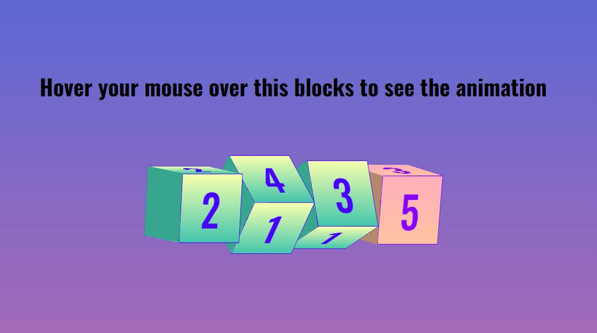

# 3D-Blocks-Animation-CSS

# Shoes-Card

<<<<<<< HEAD
This is a design of the Nike Shoes Card Animation on hover effect.

## Table of contents

- [Overview](#overview)
  - [The challenge](#the-challenge)
  - [Screenshot](#screenshot)
  - [Links](#links)
- [My process](#my-process)
  - [Built with](#built-with)
  - [What I learned](#what-i-learned)
- [Author](#author)

## Overview

### The challenge

Users should be able to:

- View the optimal animation on hovering your mouse to the card
- See hover states for all interactive elements on the page

### Screenshot



### Links

- Solution URL: [Github](https://github.com/zaidansari42/3D-Blocks-Animation-CSS/)
- Live Site URL: [Live Website](https://zaidansari42.github.io/3D-Blocks-Animation-CSS/)

## My process

### Built with

- Semantic HTML5 markup
- CSS custom properties

### What I learned

I learned how to create a beautiful card with only HTML & CSS.

```html
<div class="container">
  <div class="text" style="--j: 0">
    <span style="--i: 0">2</span>
    <span style="--i: 1">3</span>
    <span style="--i: 2">4</span>
    <span style="--i: 3">2</span>
  </div>
</div>
```

```css
transition: 2.5s ease-in-out;
transform-style: preserve-3d;
transition-delay: calc(0.25s * var(--j));
```

## Author

- Website - [Zaid Ansari](https://github.com/zaidansari42/)
- Twitter - [@zaidnasari42](https://www.twitter.com/zaidnasari42)
